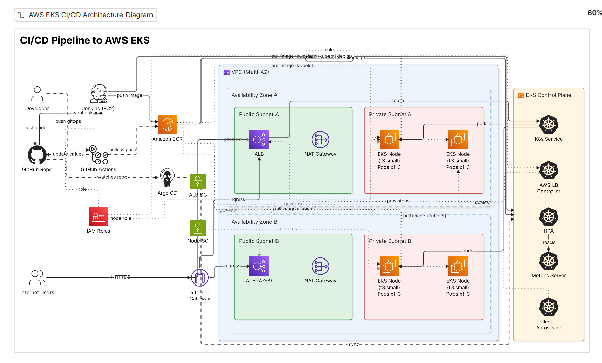

# Tech Challenge 2 — Dockerized Flask App on AWS EKS with Jenkins & GitOps CI/CD

> ⚠️ **Project Status:** The AWS infrastructure for this project has been intentionally torn down (`terraform destroy`) after completion to avoid ongoing cloud costs. The live application URL is no longer active. Anyone forking or cloning this repo can stand up the full stack themselves by following the setup steps below.

---

## Architecture



A Flask "Hello World" application is containerized with Docker and deployed to a highly available AWS EKS cluster via Helm. The repository supports **two independent CI/CD workflows**, kept on separate branches:

- **`main` branch** — Jenkins-based CI/CD (build → push to ECR → deploy via Helm)
- **`gitops` branch** — GitOps-style CI/CD using GitHub Actions (CI) + Argo CD (CD)

All infrastructure is provisioned with Terraform.

---

## Tech Stack

| Layer | Tool |
|---|---|
| Application | Python (Flask), Gunicorn |
| Containerization | Docker |
| Infrastructure as Code | Terraform |
| Orchestration | AWS EKS (Kubernetes) |
| Package Management | Helm |
| CI/CD (main) | Jenkins |
| CI/CD (gitops) | GitHub Actions + Argo CD |
| Container Registry | Amazon ECR |
| Networking | AWS VPC, ALB, NAT Gateway |
| Autoscaling | Horizontal Pod Autoscaler, Cluster Autoscaler |

---

## Prerequisites

- [Git](https://git-scm.com/)
- [Docker](https://www.docker.com/)
- [Terraform](https://developer.hashicorp.com/terraform) (v1.5+)
- [AWS CLI](https://aws.amazon.com/cli/) (configured with an IAM user with sufficient permissions for VPC, EKS, IAM, ECR, and EC2)
- [kubectl](https://kubernetes.io/docs/tasks/tools/)
- [Helm](https://helm.sh/) (v3)
- An AWS account
- A GitHub account (for the `gitops` branch workflow)

---

## Fork or Clone This Repository

**To fork (recommended if you plan to run the `gitops` branch's GitHub Actions workflow):**

Click **Fork** at the top right of this repository, then clone your fork:
```bash
git clone https://github.com/YOUR_USERNAME/eks-jenkins-cicd.git
cd eks-jenkins-cicd
```

**To clone directly (read-only):**
```bash
git clone https://github.com/ReadyProgramReen/eks-jenkins-cicd.git
cd eks-jenkins-cicd
```

---

## Branch Overview

| Branch | CI/CD Method |
|---|---|
| `main` | Jenkins pipeline (build → ECR → Helm) |
| `gitops` | GitHub Actions (build → ECR → commit tag) + Argo CD (sync to EKS) |

Choose the branch matching the workflow you want to run:
```bash
git checkout main    # for Jenkins
# or
git checkout gitops  # for GitOps
```

Both branches share the same Terraform infrastructure code and Helm chart — only the CI/CD mechanism differs.

---

## Setup: Shared Infrastructure (Required for Both Branches)

### 1. Configure AWS CLI
```bash
aws configure
```
Set your default region to `us-east-1` (or update `variables.tf` for a different region).

### 2. Find Your Public IP
Jenkins SSH access is restricted to a single IP for security.
```bash
curl -s ifconfig.me
```

### 3. Set Terraform Variables
Create `terraform/terraform.tfvars`:
```hcl
my_ip = "YOUR_IP_ADDRESS_HERE"
```

### 4. Provision the Infrastructure
```bash
cd terraform
terraform init
terraform plan
terraform apply
```
Type `yes` when prompted. Takes approximately **15-20 minutes** (EKS cluster creation is the longest step).

This provisions:
- A VPC with public/private subnets across 2 Availability Zones
- An EKS cluster with an autoscaling managed node group (1-4 nodes, t3.small)
- An ECR repository for the app image
- A Jenkins EC2 instance with all required IAM roles (used only by the `main` branch workflow)
- IAM OIDC roles for GitHub Actions (used only by the `gitops` branch workflow)

### 5. Connect kubectl to the Cluster
```bash
aws eks update-kubeconfig --region us-east-1 --name tc2-flask-eks-cluster
kubectl get nodes
```

### 6. Install Cluster Add-ons
```bash
# Metrics Server
kubectl apply -f https://github.com/kubernetes-sigs/metrics-server/releases/latest/download/components.yaml

# AWS Load Balancer Controller
helm repo add eks https://aws.github.io/eks-charts
helm repo update
kubectl apply -f k8s/alb-controller-serviceaccount.yaml
helm install aws-load-balancer-controller eks/aws-load-balancer-controller \
  -n kube-system \
  --set clusterName=tc2-flask-eks-cluster \
  --set serviceAccount.create=false \
  --set serviceAccount.name=aws-load-balancer-controller \
  --set region=us-east-1 \
  --set vpcId=$(terraform output -raw vpc_id)

# Cluster Autoscaler
helm repo add autoscaler https://kubernetes.github.io/autoscaler
helm repo update
kubectl apply -f k8s/cluster-autoscaler-serviceaccount.yaml
helm install cluster-autoscaler autoscaler/cluster-autoscaler \
  -n kube-system \
  --set autoDiscovery.clusterName=tc2-flask-eks-cluster \
  --set awsRegion=us-east-1 \
  --set rbac.serviceAccount.create=false \
  --set rbac.serviceAccount.name=cluster-autoscaler
```

### 7. Build and Push the Initial Docker Image
```bash
cd ../app
aws ecr get-login-password --region us-east-1 | docker login --username AWS --password-stdin <YOUR_ECR_REPO_URL>
docker build -t <YOUR_ECR_REPO_URL>:latest .
docker push <YOUR_ECR_REPO_URL>:latest
```
Get your ECR URL:
```bash
terraform output ecr_repository_url
```

### 8. Deploy the App with Helm
```bash
cd ..
helm install flask-hello-world helm-chart/
kubectl get pods
kubectl get ingress
```
Wait 2-3 minutes for the ALB to provision, then visit the address under `ADDRESS`.

---

## Option A: Jenkins CI/CD (`main` branch)

### 1. SSH into the Jenkins Server
```bash
ssh -i terraform/jenkins-key.pem ubuntu@$(terraform output -raw jenkins_public_ip)
```

### 2. Install Jenkins
```bash
sudo apt update && sudo apt upgrade -y
sudo apt install fontconfig openjdk-21-jre -y
curl -fsSL https://pkg.jenkins.io/debian-stable/jenkins.io-2026.key | sudo tee /usr/share/keyrings/jenkins-keyring.asc > /dev/null
echo "deb [signed-by=/usr/share/keyrings/jenkins-keyring.asc] https://pkg.jenkins.io/debian-stable binary/" | sudo tee /etc/apt/sources.list.d/jenkins.list > /dev/null
sudo apt update
sudo apt install jenkins -y
```
> Jenkins periodically rotates its repository signing key. If you hit a `NO_PUBKEY` error, check [pkg.jenkins.io](https://pkg.jenkins.io/debian-stable/) for the current key filename. Jenkins also requires Java 21+ — confirm with `java -version` and adjust if needed.

### 3. Install Docker, AWS CLI, kubectl, and Helm on the Jenkins Server
```bash
curl -fsSL https://get.docker.com -o get-docker.sh
sudo sh get-docker.sh
sudo usermod -aG docker jenkins
sudo usermod -aG docker ubuntu

curl "https://awscli.amazonaws.com/awscli-exe-linux-x86_64.zip" -o "awscliv2.zip"
sudo apt install unzip -y
unzip awscliv2.zip
sudo ./aws/install

curl -LO "https://dl.k8s.io/release/$(curl -L -s https://dl.k8s.io/release/stable.txt)/bin/linux/amd64/kubectl"
chmod +x kubectl
sudo mv kubectl /usr/local/bin/

curl https://raw.githubusercontent.com/helm/helm/main/scripts/get-helm-3 | bash

sudo systemctl restart jenkins
```

### 4. Unlock Jenkins
```bash
sudo cat /var/lib/jenkins/secrets/initialAdminPassword
```
Visit `http://<JENKINS_PUBLIC_IP>:8080`, paste the password, install **suggested plugins**, and create your admin account.

### 5. Create the Pipeline Job
1. **New Item** → name it → select **Pipeline** → OK
2. **Pipeline** section → **Definition**: **Pipeline script from SCM**
3. **SCM**: Git → **Repository URL**: this repo's URL
4. **Branch**: `*/main`
5. **Script Path**: `Jenkinsfile`
6. **Build Triggers**: check **GitHub hook trigger for GITScm polling**
7. Save

### 6. Configure the GitHub Webhook
Repo → **Settings** → **Webhooks** → **Add webhook**
- **Payload URL**: `http://<JENKINS_PUBLIC_IP>:8080/github-webhook/`
- **Content type**: `application/json`
- **Events**: Just the push event

### 7. Trigger a Deployment
Push any change to `main` — Jenkins automatically builds, pushes to ECR, and deploys via Helm.

---

## Option B: GitOps CI/CD (`gitops` branch)

### 1. Configure GitHub OIDC Trust in AWS

The `terraform/github-oidc.tf` file provisions an IAM role trusting GitHub's OIDC provider, scoped to this repository. Update the `sub` condition in that file to match your forked repo's owner/name before applying:

```hcl
"token.actions.githubusercontent.com:sub" = "repo:YOUR_USERNAME@*/YOUR_REPO_NAME@*:*"
```

> Note: GitHub Actions OIDC tokens for repositories created after July 15, 2026 use an immutable subject format that includes numeric owner/repo IDs (e.g. `repo:owner@12345/repo@67890:...`). The `@*` wildcards above account for this.

### 2. Add the AWS Role ARN as a GitHub Secret
```bash
terraform output ... # or retrieve via:
aws iam get-role --role-name tc2-flask-eks-github-actions-role --query 'Role.Arn'
```
Repo → **Settings** → **Secrets and variables** → **Actions** → **New repository secret**
- **Name**: `AWS_ROLE_ARN`
- **Value**: the role ARN

### 3. Trigger the GitHub Actions Workflow
Push any change under `app/` to the `gitops` branch. The workflow (`.github/workflows/deploy.yml`) will:
1. Authenticate to AWS via OIDC (no stored access keys)
2. Build and tag the Docker image with the commit SHA
3. Push the image to ECR
4. Update `helm-chart/values.yaml` with the new tag
5. Commit that change back to the `gitops` branch

### 4. Install Argo CD
```bash
kubectl create namespace argocd
kubectl apply -n argocd -f https://raw.githubusercontent.com/argoproj/argo-cd/stable/manifests/install.yaml
kubectl get pods -n argocd
```

### 5. Bootstrap Argo CD to the Helm Chart
Create an Argo CD `Application` resource pointing at this repo's `helm-chart/` directory on the `gitops` branch:
```bash
kubectl apply -n argocd -f - <<EOF
apiVersion: argoproj.io/v1alpha1
kind: Application
metadata:
  name: flask-hello-world
  namespace: argocd
spec:
  project: default
  source:
    repoURL: https://github.com/YOUR_USERNAME/eks-jenkins-cicd.git
    targetRevision: gitops
    path: helm-chart
  destination:
    server: https://kubernetes.default.svc
    namespace: default
  syncPolicy:
    automated:
      prune: true
      selfHeal: true
EOF
```

### 6. Access the Argo CD UI (optional)
```bash
kubectl port-forward svc/argocd-server -n argocd 8081:443
```
Visit `https://localhost:8081`. Get the initial admin password:
```bash
kubectl -n argocd get secret argocd-initial-admin-secret -o jsonpath="{.data.password}" | base64 -d
```

Once bootstrapped, Argo CD continuously watches the `gitops` branch and automatically syncs the cluster whenever `helm-chart/values.yaml` changes — no webhook or manual trigger required.

> Note: EKS node capacity may need to be increased (see `terraform/eks.tf` node group `scaling_config`) to comfortably run Argo CD's full component set alongside the application workloads.

---

## Project Structure

.
├── app/ # Flask application + Dockerfile
├── terraform/ # All AWS infrastructure (VPC, EKS, ECR, Jenkins, GitHub OIDC)
├── helm-chart/ # Kubernetes Deployment, Service, Ingress, HPA
├── k8s/ # ServiceAccounts for IRSA (ALB Controller, Cluster Autoscaler)
├── Jenkinsfile # Jenkins pipeline definition (main branch)
├── .github/workflows/deploy.yml # GitHub Actions CI workflow (gitops branch)
└── docs/ # Architecture diagram

---

## Kubernetes Scaling Configuration

Per the challenge requirements:
- **Node Group**: 1 node minimum, autoscaling up to 4 nodes (t3.small)
- **Pods**: 1 pod per node baseline, HPA scales up to 3 pods per node on 50% CPU **or** 50% memory utilization

---

## Cleanup

To avoid ongoing AWS charges, tear down all infrastructure when finished:
```bash
helm uninstall flask-hello-world
helm uninstall aws-load-balancer-controller -n kube-system
helm uninstall cluster-autoscaler -n kube-system
kubectl delete namespace argocd   # if installed

cd terraform
terraform destroy
```
> If `terraform destroy` fails on the ECR repository, empty it first: `aws ecr batch-delete-image --repository-name <repo-name> --image-ids "$(aws ecr list-images --repository-name <repo-name> --query 'imageIds[*]' --output json)"`. If it fails on the VPC with a `DependencyViolation`, check for orphaned security groups created by EKS/the ALB Controller (`aws ec2 describe-security-groups --filters "Name=vpc-id,Values=<vpc-id>"`) and delete them manually before retrying.
---

## Author

**Reena Ekeugo**